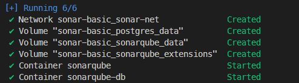
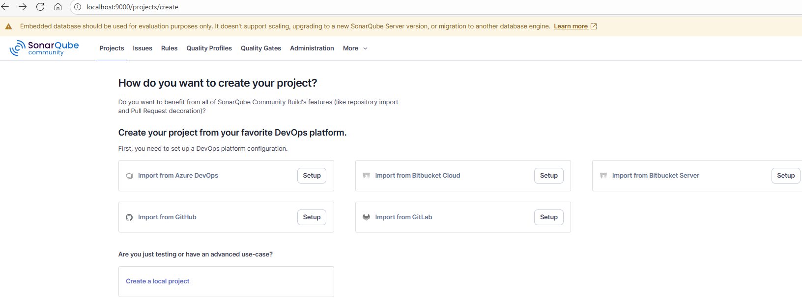

# SonarQube .NET Demo

This project demonstrates integrating a simple .NET Console application with **SonarQube** for static code analysis and quality checks.

## Prerequisites

- **Docker** for SonarQube
- **.NET SDK** for building and testing
- **SonarQube** instance (local or cloud)

### Set Up SonarQube (Docker)

1. Clone the repo and run SonarQube with Docker Compose:

   ```bash
   cd container-labs/labs/sonar/sonar-basic/
   docker-compose up -d
   ```

   

2. Access SonarQube at `http://localhost:9000` (default credentials: `admin`/`admin`).

3. Create a project in SonarQube and get the project key and token.
   

## Run the Project

1. Clone or download the repo.

2. Navigate to `SonarDemoApp` and restore dependencies:

   ```bash
   dotnet restore
   ```

3. Run the application:

   ```bash
   dotnet run
   ```

## Run Unit Tests

```bash
dotnet test
```

## SonarQube Analysis

1. Install SonarScanner:

   ```bash
   dotnet tool install --global dotnet-sonarscanner
   ```

2. Start analysis:

   ```bash
   dotnet sonarscanner begin /k:"your_project_key" /d:sonar.login="your_token"
   dotnet build
   dotnet sonarscanner end /d:sonar.login="your_token"
   ```

3. View results at `http://localhost:9000`.

## References

- https://docs.sonarsource.com/sonarqube-server/latest/
- https://docs.sonarsource.com/sonarqube-server/latest/analyzing-source-code/scanners/dotnet/installing/
- https://hub.docker.com/_/sonarqube
- https://docs.sonarsource.com/sonarqube-server/latest/server-installation/introduction/
- https://docs.sonarsource.com/sonarqube-server/latest/quality-standards-administration/managing-quality-gates/introduction-to-quality-gates/
- https://docs.sonarsource.com/sonarqube-community-build/analyzing-source-code/scanners/dotnet/introduction/

## License

MIT License.
